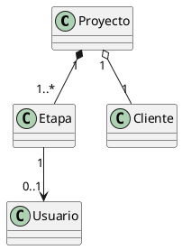

# Abstracción

La abstracción en el diseño orientado a objetos consiste en identificar las entidades relevantes del dominio del problema y modelarlas como clases, ocultando los detalles innecesarios y exponiendo únicamente la información y el comportamiento que resultan significativos para el sistema.

En el sistema de gestión de una productora de videos, la abstracción permite representar conceptos del mundo real como proyectos y etapas de trabajo mediante objetos que encapsulan tanto datos como operaciones asociadas.

Desde el punto de vista de los principios SOLID, la abstracción se relaciona principalmente con el principio de inversión de dependencias (DIP), ya que promueve que los módulos de alto nivel trabajen sobre modelos conceptuales estables y no sobre detalles concretos de implementación. Asimismo, favorece el principio de responsabilidad única (SRP), al delimitar claramente el propósito de cada clase.

En relación con los patrones de diseño, la abstracción es un habilitador fundamental para patrones como Strategy y Factory Method, ya que estos se basan en la definición de comportamientos y responsabilidades a nivel conceptual.

---

## Ejemplo en el proyecto

En el proyecto Sistema Productora de Videos, la abstracción se aplica al modelar los
conceptos principales del dominio mediante las clases Proyecto y Etapa.

Proyecto representa un trabajo audiovisual y Etapa representa una fase del proceso
de producción. Ambas clases abstraen elementos del mundo real, ocultando detalles
de implementación y concentrándose únicamente en la información y comportamientos
relevantes para el sistema.

Estas clases forman parte del diagrama definido en el archivo:

- `01-diagrama-clases-final.puml`

### Fragmento de diagrama UML

## Ejemplo de código (pseudocódigo)

proyecto = nuevo Proyecto("Video institucional")

etapa = nueva Etapa("Edición")

proyecto.agregarEtapa(etapa)

### Justificación técnica

El fragmento de pseudocódigo utiliza únicamente las abstracciones Proyecto y Etapa, sin depender de estructuras internas ni detalles de almacenamiento.
Esto demuestra el uso de abstracción, ya que el cliente del modelo interactúa con
objetos que representan conceptos del dominio, delegando en dichas clases la gestión de su comportamiento interno.

