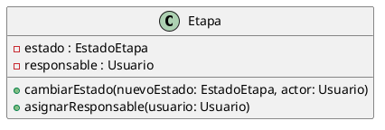

# Encapsulamiento

El encapsulamiento es un principio del Diseño Orientado a Objetos que consiste en
proteger el estado interno de los objetos y permitir que dicho estado sea modificado
únicamente a través de operaciones definidas por la propia clase.

En el sistema de la productora de videos, este principio se observa principalmente
en la clase Etapa.

La clase Etapa posee atributos como estado, prioridad, fechas, observaciones y
responsable, los cuales no se modifican de manera directa desde otras clases, sino
mediante métodos específicos que controlan el cambio de su estado interno.

Entre las operaciones que reflejan este principio se encuentran:

- cambiarEstado(nuevoEstado, actor)
- asignarResponsable(usuario)
- agregarComentario(comentario)
- adjuntar(adjunto)

De esta manera, la propia clase Etapa es la encargada de validar y centralizar
las modificaciones sobre su información.

Esto permite:

- evitar modificaciones inconsistentes del estado de una etapa,
- centralizar las reglas de negocio,
- mantener bajo acoplamiento entre las clases.

El encapsulamiento también se aplica en la clase Proyecto, ya que la gestión de sus
etapas se realiza a través de operaciones como agregarEtapa y eliminarEtapa, evitando
el acceso directo a la estructura interna que las contiene.

Este enfoque favorece la mantenibilidad del sistema y se alinea con el principio de
Responsabilidad Única (SRP), ya que cada clase es responsable de proteger y administrar
su propio estado.

```md
## Ejemplo en el proyecto

En el modelo de clases actual del sistema no se definieron jerarquías de herencia ni
interfaces, por lo que no se aplica polimorfismo de manera explícita en el diseño.

Las clases del dominio se relacionan mediante asociaciones, dependencias y
composición, priorizando un diseño simple y centrado en las entidades principales
del problema.

### Fragmento de diagrama UML

### Justificación técnica

En el diseño actual no se utiliza polimorfismo basado en herencia, ya que no existen
clases base ni subclases en el modelo.

Esto implica que el principio de sustitución de Liskov (LSP) no se aplica de forma
directa en esta versión del diseño, quedando el modelo preparado para una futura
evolución donde puedan incorporarse jerarquías o interfaces sin modificar las
relaciones principales existentes.
