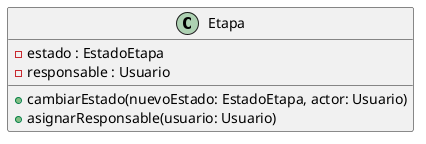

# Encapsulamiento

El encapsulamiento es un principio del Diseño Orientado a Objetos que consiste en
proteger el estado interno de los objetos y permitir que dicho estado sea modificado
únicamente a través de operaciones definidas por la propia clase.

En el sistema de la productora de videos, este principio se observa principalmente
en la clase Etapa.

La clase Etapa posee atributos como estado, prioridad, fechas, observaciones y
responsable, los cuales no se modifican de manera directa desde otras clases, sino
mediante métodos específicos que controlan el cambio de su estado interno.

Entre las operaciones que reflejan este principio se encuentran:

- cambiarEstado(nuevoEstado, actor)
- asignarResponsable(usuario)
- agregarComentario(comentario)
- adjuntar(adjunto)

De esta manera, la propia clase Etapa es la encargada de validar y centralizar
las modificaciones sobre su información.

Esto permite:

- evitar modificaciones inconsistentes del estado de una etapa,
- centralizar las reglas de negocio,
- mantener bajo acoplamiento entre las clases.

El encapsulamiento también se aplica en la clase Proyecto, ya que la gestión de sus
etapas se realiza a través de operaciones como agregarEtapa y eliminarEtapa, evitando
el acceso directo a la estructura interna que las contiene.

Este enfoque favorece la mantenibilidad del sistema y se alinea con el principio de
Responsabilidad Única (SRP), ya que cada clase es responsable de proteger y administrar
su propio estado.

## Ejemplo en el proyecto

En la clase Etapa, los atributos estado y responsable se definen con
visibilidad privada (private) y no pueden ser accedidos directamente desde
el exterior.

La modificación de estos atributos se realiza únicamente a través de los
métodos públicos cambiarEstado(...) y asignarResponsable(...).

### Fragmento de diagrama UML

### Justificación técnica

El encapsulamiento permite proteger el estado interno de los objetos, obligando a que
las modificaciones se realicen mediante operaciones controladas, asegurando la
consistencia y las reglas de negocio del dominio.
