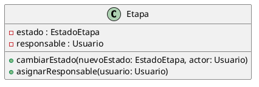

# Encapsulamiento

El encapsulamiento es un principio del Diseño Orientado a Objetos que consiste en
proteger el estado interno de los objetos y permitir que dicho estado sea modificado
únicamente a través de operaciones definidas por la propia clase.

Su importancia radica en preservar la consistencia de los objetos, evitar dependencias
innecesarias con la implementación interna y facilitar el mantenimiento del sistema.

### Relación con principios SOLID y patrones de diseño

El encapsulamiento se relaciona directamente con el principio de responsabilidad única
(SRP), ya que cada clase es responsable de mantener y proteger su propio estado interno.

También se relaciona con el principio de abierto/cerrado (OCP), ya que al exponer
operaciones públicas bien definidas se pueden extender comportamientos sin modificar
la estructura interna de las clases.

En cuanto a los patrones de diseño, el encapsulamiento es fundamental en patrones como
State y Strategy, donde el comportamiento y el estado quedan contenidos dentro de
objetos bien definidos, evitando que el resto del sistema dependa de sus detalles
internos.

---

## Ejemplo en el proyecto

En el sistema de la productora de videos, este principio se observa principalmente en
la clase Etapa.

Los atributos estado y responsable se encuentran definidos con visibilidad privada,
evitando su acceso directo desde otras clases.

El cambio del estado de una etapa y la asignación de responsables se realiza únicamente
a través de las operaciones cambiarEstado y asignarResponsable, garantizando la
consistencia y el cumplimiento de las reglas de negocio del dominio.

De la misma forma, la gestión de las etapas de un proyecto se realiza a través de
operaciones como agregarEtapa y eliminarEtapa, evitando el acceso directo a la
estructura interna que las contiene.

### Fragmento de diagrama UML



```md
## Ejemplo de código (pseudocódigo)

```text
etapa.cambiarEstado(nuevoEstado, usuarioActual)
etapa.asignarResponsable(usuario)
```
### Justificación técnica

El encapsulamiento se aplica porque el estado interno de la clase Etapa no puede ser modificado directamente desde el exterior y solo es accesible mediante métodos públicos controlados por la propia clase.

```
### Relación con principios SOLID y patrones

El encapsulamiento se relaciona directamente con el principio de responsabilidad única (SRP),
ya que cada clase es responsable de mantener y proteger su propio estado interno.

También se relaciona con el principio de abierto/cerrado (OCP), ya que al exponer únicamente
operaciones públicas bien definidas se pueden extender comportamientos sin modificar
el estado interno de las clases.

En cuanto a los patrones de diseño, el encapsulamiento es fundamental en patrones como
State y Strategy, donde el comportamiento y el estado quedan contenidos dentro de
objetos bien definidos, evitando que el resto del sistema dependa de sus detalles internos.
```