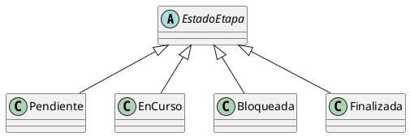

# Herencia

## Ejemplo en el proyecto

En el proyecto se aplica herencia en el manejo de los estados de una etapa.  
La clase abstracta `EstadoEtapa` define el comportamiento común de los estados, y las clases
`Pendiente`, `EnCurso`, `Bloqueada` y `Finalizada` heredan de ella, especializando el
comportamiento según el estado concreto.

Este diseño permite modelar los distintos estados de una etapa como objetos con un
comportamiento específico, reutilizando la estructura definida en la clase base.

## Fragmento de diagrama UML

## Justificación técnica

La herencia se aplica mediante la jerarquía de la clase base EstadoEtapa y sus clases derivadas Pendiente, EnCurso, Bloqueada y Finalizada, que reutilizan la estructura común y especializan su comportamiento.