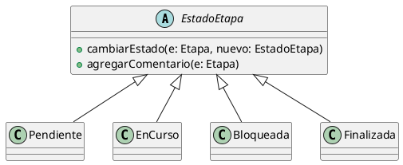

# Herencia
La herencia es un principio del diseño orientado a objetos que permite definir nuevas
clases a partir de otras, reutilizando estructura y comportamiento, y estableciendo
una relación jerárquica entre una clase base y sus subclases.

Su importancia radica en la reutilización de código y en la posibilidad de modelar
especializaciones de un mismo concepto dentro del dominio.

Desde el punto de vista de SOLID, la herencia se relaciona con el principio de
abierto/cerrado (OCP), ya que permite extender el comportamiento de una clase sin
modificar su implementación original.

En relación con los patrones de diseño, la herencia es utilizada en patrones como
Template Method, donde una clase base define un algoritmo general y las subclases
especializan algunos pasos del mismo.

## Ejemplo en el proyecto

En el proyecto se aplica herencia en el manejo de los estados de una etapa.  
La clase abstracta `EstadoEtapa` define el comportamiento común de los estados, y las clases
`Pendiente`, `EnCurso`, `Bloqueada` y `Finalizada` heredan de ella, especializando el
comportamiento según el estado concreto.

Este diseño permite modelar los distintos estados de una etapa como objetos con un
comportamiento específico, reutilizando la estructura definida en la clase base.

## Fragmento de diagrama UML



```md
## Ejemplo de código (pseudocódigo)

```text
estado : EstadoEtapa

estado = new Pendiente()

estado.cambiarEstado(etapa, new EnCurso())
```md
### Justificación técnica

En el proyecto se aplica herencia en el manejo de los estados de una etapa.  
La clase abstracta `EstadoEtapa` define el comportamiento común de los estados, y las clases `Pendiente`, `EnCurso`, `Bloqueada` y `Finalizada` heredan de ella, especializando el comportamiento según el estado concreto.