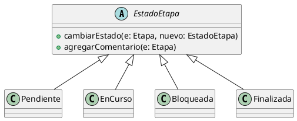

# Herencia

La herencia es un principio del diseño orientado a objetos que permite definir nuevas
clases a partir de una clase base, reutilizando estructura y comportamiento, y
estableciendo una relación jerárquica entre una superclase y sus subclases.

Su importancia radica en la reutilización de código y en la posibilidad de modelar
especializaciones de un mismo concepto dentro del dominio.

Desde el punto de vista de los principios SOLID, la herencia se relaciona con el
principio de abierto/cerrado (OCP), ya que permite extender el comportamiento de una
clase base mediante subclases sin modificar su implementación original.

En relación con los patrones de diseño, la herencia es utilizada en patrones como
Template Method, donde una clase base define la estructura general de un algoritmo y
las subclases redefinen partes específicas.

---

## Ejemplo en el proyecto

En el proyecto se aplica herencia en el manejo de los estados de una etapa.

La clase abstracta EstadoEtapa define el comportamiento común de todos los estados,
y las clases Pendiente, EnCurso, Bloqueada y Finalizada heredan de ella, implementando
o especializando dicho comportamiento.

De esta forma, cada estado concreto representa una especialización del concepto
general de estado de una etapa.

### Fragmento de diagrama UML



```md
## Ejemplo de código (pseudocódigo)
estado : EstadoEtapa

estado = new Pendiente()
estado.cambiarEstado(etapa, new EnCurso())
```
### Justificación técnica
La herencia se aplica porque las clases Pendiente, EnCurso, Bloqueada y Finalizada son subclases de EstadoEtapa y heredan su interfaz y comportamiento común.
En el pseudocódigo, la variable estado está declarada con el tipo de la superclase EstadoEtapa, pero en tiempo de ejecución referencia un objeto de la subclase Pendiente, lo que demuestra que las clases concretas reutilizan y extienden la funcionalidad
definida en la clase base.