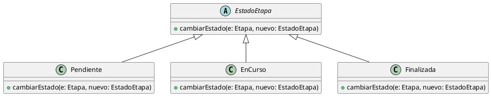

# Polimorfismo
El polimorfismo es un principio del diseño orientado a objetos que permite que un mismo
mensaje u operación se comporte de manera diferente según el objeto concreto que lo
recibe.

Su importancia radica en que permite desacoplar el uso de los objetos de su
implementación concreta, favoreciendo diseños más flexibles y extensibles.

Desde el punto de vista de SOLID, el polimorfismo se relaciona principalmente con el
principio de sustitución de Liskov (LSP), ya que las subclases deben poder ser utilizadas
en lugar de la clase base sin alterar el comportamiento esperado del sistema.

También se relaciona con el principio de inversión de dependencias (DIP), al permitir
que el sistema dependa de abstracciones y no de implementaciones concretas.

En cuanto a los patrones de diseño, el polimorfismo es la base de patrones como
Strategy y State, donde distintas implementaciones de un mismo comportamiento se
utilizan de forma intercambiable.

## Ejemplo en el proyecto

El polimorfismo se aplica en el manejo de los estados de una etapa, cuando la
etapa invoca el método cambiarEstado sobre una referencia de tipo EstadoEtapa.

Según la clase concreta del estado (Pendiente, EnCurso o Finalizada), se
ejecuta una implementación distinta del mismo método.

## Fragmento de diagrama UML


## Ejemplo de código (pseudocódigo)

```text
estadoActual : EstadoEtapa

estadoActual = new EnCurso()
estadoActual.cambiarEstado(etapa, new Finalizada())
```

```md
### Justificación técnica

Se aplica polimorfismo porque el sistema invoca el método cambiarEstado a
través de una referencia del tipo EstadoEtapa, y en tiempo de ejecución se
ejecuta la implementación correspondiente a la clase concreta del estado
(EnCurso, Pendiente o Finalizada).