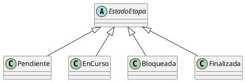

```md
# Polimorfismo

## Ejemplo en el proyecto

El polimorfismo se aplica cuando la etapa trabaja con el tipo abstracto `EstadoEtapa`,
sin conocer la clase concreta que lo implementa.

Las instancias de `Pendiente`, `EnCurso`, `Bloqueada` o `Finalizada` se utilizan de forma
intercambiable a través de la referencia común `EstadoEtapa`.

## Fragmento de diagrama UML



## Ejemplo de código (pseudocódigo)

```text
estadoActual : EstadoEtapa
estadoActual = new EnCurso()
estadoActual.cambiarEstado(etapa, new Finalizada())
```

Justificación técnica

El polimorfismo se aplica porque el sistema utiliza referencias del tipo EstadoEtapa
que en tiempo de ejecución pueden ser instancias concretas como EnCurso o Finalizada,
ejecutando el comportamiento correspondiente según el tipo real del objeto.