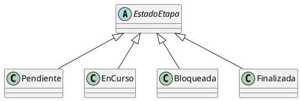

```md
# Polimorfismo

## Ejemplo en el proyecto

El polimorfismo se aplica cuando la etapa trabaja con el tipo abstracto `EstadoEtapa`,
sin conocer la clase concreta que lo implementa.

Las instancias de `Pendiente`, `EnCurso`, `Bloqueada` o `Finalizada` se utilizan de forma
intercambiable a través de la referencia común `EstadoEtapa`.

## Fragmento de diagrama UML



## Ejemplo de código (pseudocódigo)

estadoActual : EstadoEtapa

estadoActual = new Pendiente()
estadoActual.cambiarEstado(etapa, new EnCurso())

estadoActual = new EnCurso()
estadoActual.cambiarEstado(etapa, new Finalizada())

Justificación técnica

La etapa opera sobre la abstracción EstadoEtapa, permitiendo que distintas
implementaciones concreten el comportamiento sin que el código cliente deba modificarse.
Esto cumple con el principio de sustitución (LSP) y permite extender el sistema incorporando
nuevos estados sin afectar al resto del diseño.