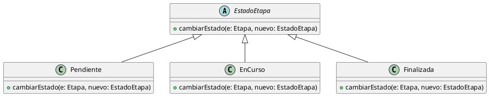

# Polimorfismo

## Ejemplo en el proyecto

El polimorfismo se aplica en el manejo de los estados de una etapa, cuando la
etapa invoca el método cambiarEstado sobre una referencia de tipo EstadoEtapa.

Según la clase concreta del estado (Pendiente, EnCurso o Finalizada), se
ejecuta una implementación distinta del mismo método.

## Fragmento de diagrama UML


## Ejemplo de código (pseudocódigo)

```text
estadoActual : EstadoEtapa

estadoActual = new EnCurso()
estadoActual.cambiarEstado(etapa, new Finalizada())
```

```md
### Justificación técnica

Se aplica polimorfismo porque el sistema invoca el método cambiarEstado a
través de una referencia del tipo EstadoEtapa, y en tiempo de ejecución se
ejecuta la implementación correspondiente a la clase concreta del estado
(EnCurso, Pendiente o Finalizada).