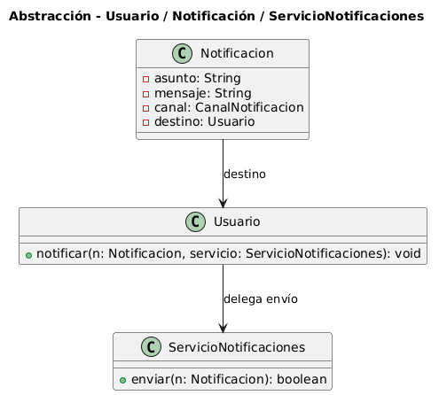

# Abstracción

## Ejemplo en el proyecto

### 1) Concepto

La **abstracción** consiste en representar una entidad o acción quedándonos con lo importante para el problema y dejando de lado los detalles que no aportan. En Diseño Orientado a Objetos, significa pensar primero en qué responsabilidad cumple una clase (**qué hace y para qué**) y no tanto en **cómo está implementado** internamente.

El uso de **abstracciones** (interfaces o clases abstractas) permite trabajar con distintos **niveles** del sistema: por ejemplo, a alto nivel “enviar una notificación”, y a bajo nivel “enviar por email / WhatsApp / push”, sin que el resto del sistema dependa de los detalles.

En DOO, la abstracción se logra mediante:
- **Representación del problema:** clases que reflejan los conceptos principales del sistema (por ejemplo, Proyecto, Etapa, Usuario, Notificación), con sus datos y operaciones relevantes.
- **Clases abstractas**: definen comportamientos comunes y obligan a las subclases a completar lo específico.
- **Interfaces**: establecen contratos que las clases deben cumplir.
- **Métodos abstractos**: declaran operaciones sin especificar su implementación.

El objetivo es construir un modelo conceptual claro, **fácil de entender y mantener**, y que permita **cambiar o extender implementaciones** con el menor impacto posible en el resto del sistema.


### 2) Relación con SOLID y Patrones de Diseño

#### Principios SOLID (los más relacionados)
- **DIP (Dependency Inversion Principle):**

    Los módulos de alto nivel dependen de abstracciones, no de implementaciones concretas, invirtiendo la dirección tradicional de dependencias.


- **OCP (Open/Closed Principle):**

    Las abstracciones permiten extender funcionalidad sin modificar código existente. Al programar contra interfaces o clases abstractas, podemos agregar nuevas implementaciones sin alterar el código que las consume.

- **SRP (Single Responsibility Principle):**

    La abstracción ayuda a repartir responsabilidades: las clases del dominio. Se enfocan en reglas del negocio, y los detalles técnicos (por ejemplo, cómo se envía), se dejan en servicios o clases especializadas.

#### Patrones de Diseño (relación directa con abstracción)
- **Factory Method (Creacional):**  
  Utiliza abstracción para definir una interfaz de creación de objetos, delegando a las subclases la decisión de qué clase concreta instanciar.

- **Strategy (Comportamiento):**  
  Define una familia de algoritmos mediante una interfaz abstracta, permitiendo intercambiar implementaciones dinámicamente.

- **Template Method**  
  Usa una clase abstracta para definir el esqueleto de un algoritmo, dejando que las subclases implementen pasos específicos.

### 3) Aplicación en el proyecto
En el proyecto, clases como `ServicioNotificaciones` abstraen la operación “enviar notificación”, permitiendo que el dominio (`Usuario`, `Notificacion`) trabaje con el **qué** se hace sin acoplarse al **cómo** se implementa (proveedor, canal, límites, etc.).


### 4) Diagrama UML (fragmento) + enlace al diagrama

A continuación se presenta incrustado  **diagrama de clases** elaborado en el curso.
La idea es mostrar cómo el dominio (por ejemplo `Usuario` y `Notificacion`) se apoya en un servicio (`ServicioNotificaciones`) para realizar el envío, sin depender de detalles técnicos del proveedor o canal.

#### Imagen incrustada


#### Enlace al diagrama en detalle

- [Ver diagrama en detalle](img/abstraccion-notificaciones.png)

- [Ver código PlantUML](img/abstraccion-notificaciones.puml)


## Ejemplo de Código


#### 1) Fragmento de código (Java)

```java
// Concepto del dominio: "qué" es una notificación (datos relevantes del negocio)
public class Notificacion {
    private String asunto;
    private String mensaje;
    private Usuario destino;
    private CanalNotificacion canal;

    public Notificacion(String asunto, String mensaje, Usuario destino, CanalNotificacion canal) {
        this.asunto = asunto;
        this.mensaje = mensaje;
        this.destino = destino;
        this.canal = canal;
    }
}

// Servicio: "cómo" se realiza el envío (detalle técnico)
public class ServicioNotificaciones {
    public boolean enviar(Notificacion n) {
        // Aquí iría el detalle real: proveedor, API, logs, límites, reintentos, etc.
        return true;
    }
}

// Dominio: expresa la intención "notificar" y delega el cómo al servicio
public class Usuario {
    public void notificar(Notificacion n, ServicioNotificaciones servicio) {
        servicio.enviar(n);
    }
}

```
### 2) Justificación técnica

`ServicioNotificaciones` actúa como la abstracción del envío: concentra el “cómo” (proveedor/canal) y permite que el dominio use el “qué” (notificar) sin depender de detalles técnicos.
- `Notificacion` modela el concepto del negocio “notificación” con sus datos relevantes (asunto, mensaje, destino, canal), sin incluir detalles de infraestructura.
- `Usuario.notificar`(...) representa la intención de alto nivel (“notificar”) y no se ocupa de cómo se envía realmente.
- `ServicioNotificaciones.enviar`(...) encapsula el “cómo” (proveedor/API/límites).
En conjunto, el diseño separa qué se quiere hacer (notificar) de cómo se implementa (enviar), que es el núcleo de la abstracción