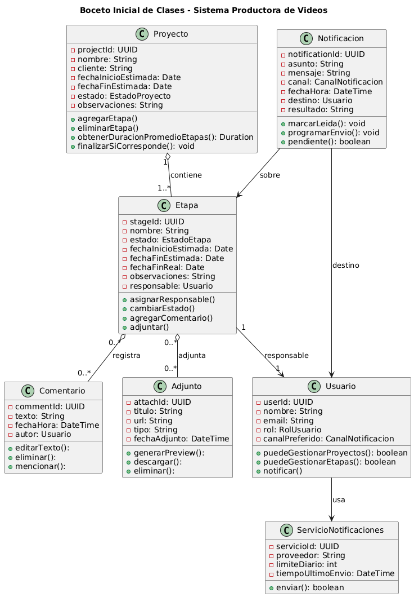

# Encapsulamiento

## 1) Concepto

El **encapsulamiento** es el mecanismo de ocultar los detalles internos de implementación de una clase y controlar el acceso a sus datos mediante una interfaz pública bien definida. En Diseño Orientado a Objetos, significa que los atributos de una clase se mantienen privados y solo se accede a ellos a través de métodos públicos  o mediante operaciones que respeten las reglas del negocio.

El encapsulamiento permite:
- **Protección de datos:** evitar que datos internos se modifiquen de forma inválida o inconsistente desde el exterior.
- **Ocultamiento de implementación:** los detalles de cómo se almacenan o calculan los datos quedan ocultos; el exterior solo conoce la interfaz pública.
- **Control de acceso:** definir qué operaciones están permitidas sobre los datos y bajo qué condiciones.
- **Flexibilidad para cambiar:** modificar la implementación interna sin afectar al código que usa la clase.

El encapsulamiento se logra mediante:
- **Modificadores de acceso:** `private` (solo dentro de la clase), `protected` (clase y subclases), `public` (acceso desde cualquier lugar).
- **Getters y setters:** métodos que controlan la lectura y escritura de atributos privados.
- **Métodos de validación:** lógica que garantiza que los datos siempre cumplan las reglas del negocio.
- **Invariantes de clase:** condiciones que deben mantenerse verdaderas durante toda la vida del objeto.

El objetivo es crear objetos **robustos** que garanticen su **integridad interna**, faciliten el **mantenimiento** y permitan **evolucionar la implementación** sin romper el código que depende de ellos.

---

## 2) Relación con SOLID y Patrones

### Principios SOLID

- **SRP (Single Responsibility Principle):**

    El encapsulamiento ayuda a concentrar en una clase toda la lógica relacionada con sus datos. Por ejemplo, la clase `Proyecto` encapsula las reglas de validación de fechas, cálculo de duración y gestión de etapas, evitando que esta lógica se disperse por el sistema.

- **OCP (Open/Closed Principle):**

    Al ocultar los detalles de implementación, podemos cambiar cómo se calculan o almacenan los datos internamente sin modificar el código cliente. Por ejemplo, cambiar de `ArrayList` a `LinkedList` internamente no afecta a quien usa la clase.

- **ISP (Interfase Segregation):**

    Cuando exponemos solo lo necesario, evitamos obligar a otros módulos a depender de operaciones que no usan.
    (Relacionado) Encapsular reduce acoplamiento, lo cual favorece OCP/DIP indirectamente.

### Patrones de diseño

- **Facade (Estructural):**  
  Encapsula la complejidad de un subsistema detrás de una interfaz simple. Oculta múltiples clases e interacciones complejas tras un punto de acceso unificado.

- **Template Method (Comportamiento):**  
  Encapsula el algoritmo general en la clase padre, ocultando los detalles de implementación específicos en métodos protegidos que las subclases sobrescriben.

- **Strategy (Comportamiento):**  
  Encapsula familias de algoritmos en clases separadas, ocultando los detalles de cada estrategia detrás de una interfaz común.

---

## 3) Aplicación en el proyecto

En **SistemaProductoraVideos**, el encapsulamiento se evidencia cuando las clases del dominio:
- Mantienen sus atributos como privados (por ejemplo `Etapa.estado`, `Etapa.fechaFinReal`, `Notificacion.resultado`).
- Controlan cambios mediante métodos como `Etapa.cambiarEstado()`, `Proyecto.finalizarSiCorresponde()`, `Notificacion.marcarLeida()`.

Esto evita que cualquier parte del sistema cambie “a mano” el estado de una etapa o una notificación sin respetar reglas (por ejemplo, no permitir finalizar una etapa sin datos mínimos, o no permitir volver a un estado anterior).

---

## 4) Ejemplo en el proyecto (UML + evidencia)

### 4.1 Imagen incrustada



### 4.2 Enlace al diagrama en detalle
[Ver diagrama en detalle](../../diagramas/01-diagrama-clases/01-boceto-inicial.png)

¿Cómo refleja encapsulamiento el diagrama?
En el diagrama se observa encapsulamiento porque:
- Los atributos aparecen con `-` (privados), lo que indica que no se accede directamente desde afuera.
- Las modificaciones relevantes del estado se hacen mediante métodos `+` (públicos) como `cambiarEstado()`, `agregarComentario()`, `marcarLeida()`, etc.
- De esta forma, el objeto controla sus cambios y mantiene consistencia.

---

## 5) Ejemplo de código + justificación

```java
public class Etapa {
    private EstadoEtapa estado;
    private Date fechaFinReal;

    public void cambiarEstado(EstadoEtapa nuevoEstado) {
        // Reglas de negocio (ejemplo):
        // no permitir finalizar si no hay fecha fin real
        if (nuevoEstado == EstadoEtapa.FINALIZADA && fechaFinReal == null) {
            throw new IllegalStateException("No se puede finalizar sin fecha fin real.");
        }
        this.estado = nuevoEstado;
    }

    public void registrarFechaFinReal(Date fecha) {
        this.fechaFinReal = fecha;
    }

    public EstadoEtapa getEstado() {
        return estado; // lectura controlada
    }
}

```
**Justificación técnica:** 
Las clases seleccionadas cumplen encapsulamiento porque:
- Protegen sus datos internos.
- Exponen una interfaz pública acotada para operar sobre ese estado.
- Permiten aplicar validaciones y reglas de negocio antes de modificar atributos.
