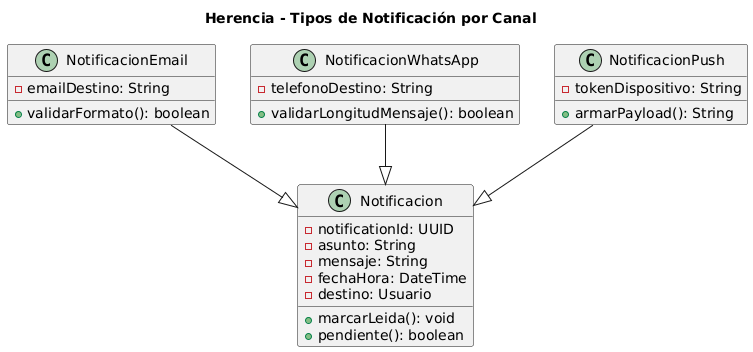

# Herencia

## Ejemplo en el proyecto

### 1) Concepto

La **herencia** es un mecanismo que permite crear nuevas clases a partir de clases existentes, reutilizando y extendiendo su comportamiento. La clase nueva (llamada **subclase**, **clase hija** o **clase derivada**) hereda atributos y métodos de la clase original (llamada **superclase**, **clase padre** o **clase base**).

En Diseño Orientado a Objetos, la herencia permite:
- **Reutilización de código:** evitar duplicación al compartir comportamiento común en la clase padre.
- **Especialización:** las subclases pueden agregar atributos y métodos específicos o modificar (sobrescribir) los heredados.
- **Jerarquías conceptuales:** modelar relaciones del tipo "es un" (por ejemplo, un VideoPublicitario **es un** Video).

La herencia se logra mediante:
- **Clases concretas heredando de otras concretas:** cuando una clase extiende otra con implementación completa.
- **Clases heredando de clases abstractas:** la clase padre define el esqueleto y las hijas completan detalles específicos.
- **Implementación de interfaces:** aunque técnicamente es "implementar", establece una relación de herencia de contrato.
- **Sobrescritura de métodos:** las subclases redefinen métodos heredados para comportamiento específico.

El objetivo es construir jerarquías de clases que **reflejen la realidad del dominio**, promoviendo la **reutilización** y facilitando la **extensibilidad** del sistema sin duplicar código.

---
### 2) Relación con SOLID y Patrones de Diseño

#### Principios SOLID (los más relacionados)

- **LSP (Liskov Substitution Principle):**

    Las subclases deben poder sustituir a sus clases base sin alterar el comportamiento esperado del sistema. Esto garantiza que la herencia sea correcta: si tengo un método que recibe `Video`, debe funcionar igual con `VideoPublicitario` o `VideoDocumental`.

- **OCP (Open/Closed Principle):**

    La herencia permite extender funcionalidad creando nuevas subclases sin modificar la clase padre. Puedo agregar nuevos tipos de videos sin tocar la clase `Video` original.

- **SRP (Single Responsibility Principle):**

    Cada clase en la jerarquía tiene una responsabilidad específica: la clase padre maneja lo común, y cada hija maneja su especialización particular. Por ejemplo, `Video` maneja atributos generales, mientras que `VideoPublicitario` maneja la lógica de publicidad.


#### Patrones de Diseño (relación con herencia)

- **Template Method (Comportamiento):**  
  Define el esqueleto de un algoritmo en la clase padre usando métodos abstractos que las subclases deben implementar. La herencia es esencial para este patrón.

- **Factory Method (Creacional):**  
  Utiliza herencia para delegar la creación de objetos a las subclases, donde cada subclase decide qué clase concreta instanciar.

- **Strategy (Comportamiento):**  
  Aunque usa composición, puede combinarse con herencia cuando diferentes estrategias comparten comportamiento común en una clase base.


### 3) Aplicación en el proyecto

En el proyecto, la clase Notificacion hoy tiene canal: CanalNotificacion. La herencia se puede modelar así:

Superclase: Notificacion (datos comunes: asunto, mensaje, destino, fechaHora, etc.)

Subclases: NotificacionEmail, NotificacionWhatsApp, NotificacionPush

Ventaja: cada subclase puede especializar validaciones o formato (subject obligatorio en email, límite de caracteres en WhatsApp, etc). Esto se alinea con los conceptos LSP y con OCP.


### 4) Diagrama UML (fragmento) + enlace al diagrama


A continuación se presenta un **fragmento de diagrama UML** que muestra una posible aplicación de herencia en el proyecto: distintos tipos de notificación según el canal.  
La idea es que `Notificacion` concentre lo común y que las subclases especialicen lo particular de cada canal.

#### Imagen incrustada



#### Enlace al diagrama en detalle

- [Ver diagrama en detalle](img/herencia-notificaciones.png)

- [Ver código PlantUML](img/herencia-notificaciones.puml)


## Ejemplo de Código

#### 1) Fragmento de código (Java)
```java
// Superclase: concentra lo común a cualquier notificación
public class Notificacion {
    protected String asunto;
    protected String mensaje;
    protected Usuario destino;

    public Notificacion(String asunto, String mensaje, Usuario destino) {
        this.asunto = asunto;
        this.mensaje = mensaje;
        this.destino = destino;
    }

    public boolean pendiente() {
        // Ejemplo simplificado: una notificación recién creada está pendiente
        return true;
    }
}

// Subclase: especializa para Email
public class NotificacionEmail extends Notificacion {
    private String emailDestino;

    public NotificacionEmail(String asunto, String mensaje, Usuario destino, String emailDestino) {
        super(asunto, mensaje, destino);   // reutiliza constructor de la superclase
        this.emailDestino = emailDestino;
    }

    public boolean validarFormatoEmail() {
        return emailDestino != null && emailDestino.contains("@");
    }
}

// Subclase: especializa para WhatsApp
public class NotificacionWhatsApp extends Notificacion {
    private String telefonoDestino;

    public NotificacionWhatsApp(String asunto, String mensaje, Usuario destino, String telefonoDestino) {
        super(asunto, mensaje, destino);
        this.telefonoDestino = telefonoDestino;
    }

    public boolean validarLongitudMensaje() {
        return mensaje != null && mensaje.length() <= 1000;
    }
}

```
### 2) Justificación técnica

Este fragmento demuestra el fundamento de herencia porque:

- Reutilización de lo común: NotificacionEmail y NotificacionWhatsApp heredan (extends) de Notificacion, reutilizando atributos y comportamiento compartido (asunto, mensaje, destino, pendiente()).
- Especialización: cada subclase agrega datos y reglas propias del canal (emailDestino, telefonoDestino, validaciones específicas), sin duplicar lo que ya está en la superclase.
- Relación “es un”: una NotificacionEmail es una Notificacion y una NotificacionWhatsApp es una Notificacion, por lo que el modelo representa correctamente variantes del mismo concepto del dominio.
- Base para polimorfismo: al heredar de Notificacion, el sistema podría manejar listas de Notificacion que contengan distintos tipos concretos, manteniendo una interfaz común para lo compartido.