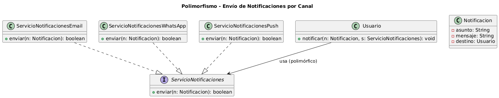

# Polimorfismo

## Ejemplo en el proyecto

### 1) Concepto

El **polimorfismo** es la capacidad de objetos de diferentes clases de responder al mismo mensaje (llamada a método) de distintas maneras. En Diseño Orientado a Objetos, significa que una misma interfaz puede tener múltiples implementaciones, permitiendo que el código trabaje con abstracciones sin conocer el tipo concreto del objeto.

En DOO, el polimorfismo permite:
- **Flexibilidad:** escribir código que funciona con múltiples tipos de objetos sin conocer sus detalles específicos.
- **Extensibilidad:** agregar nuevos tipos sin modificar el código que los utiliza.
- **Reutilización:** una misma operación puede aplicarse a diferentes objetos de forma coherente.
- **Desacoplamiento:** el código cliente depende de abstracciones, no de implementaciones concretas.

El polimorfismo se logra mediante:
- **Sobrescritura (Override):** las subclases redefinen métodos heredados para proporcionar comportamiento específico.
- **Sobrecarga (Overload):** múltiples métodos con el mismo nombre pero diferentes parámetros en la misma clase.
- **Interfaces:** diferentes clases implementan la misma interfaz, cada una con su propia lógica.
- **Clases abstractas:** definen métodos que las subclases deben implementar a su manera.

El objetivo es escribir código **genérico y flexible** que pueda trabajar con familias de objetos relacionados, facilitando la **evolución del sistema** sin necesidad de cambios masivos en el código existente.

---

### 2) Relación con SOLID y Patrones

#### Principios SOLID

- **LSP (Liskov Substitution Principle):**

    El polimorfismo depende de que las subclases puedan sustituir a sus clases base sin alterar el comportamiento esperado. Si un método espera un `Video`, debe funcionar correctamente con `VideoPublicitario`, `VideoDocumental`, etc.

- **OCP (Open/Closed Principle):**

    El polimorfismo permite extender funcionalidad agregando nuevas clases que implementen la misma interfaz, sin modificar el código que las usa. Puedo agregar `NotificacionSlack` sin cambiar `ServicioNotificaciones`.

- **DIP (Dependency Inversion Principle):**

    El polimorfismo permite que el código dependa de abstracciones (interfaces, clases abstractas) en lugar de clases concretas, facilitando el intercambio de implementaciones.

#### Patrones de Diseño

- **Strategy (Comportamiento):**  
  Define una familia de algoritmos intercambiables mediante polimorfismo. El contexto trabaja con una interfaz, y cada estrategia concreta implementa su versión del algoritmo.

- **Factory Method (Creacional):**  
  Usa polimorfismo para permitir que las subclases decidan qué clase concreta instanciar, delegando la creación de objetos.

- **Template Method (Comportamiento):**  
  Combina herencia y polimorfismo: la clase padre define el esqueleto del algoritmo y las subclases implementan pasos específicos mediante sobrescritura.

---

### 3) Aplicación en el proyecto

En **SistemaProductoraVideos**, una aplicación natural de polimorfismo es el envío de notificaciones por diferentes canales.

El sistema puede manejar una colección de “notificaciones” o “servicios de envío” sin conocer el detalle del canal.  
Por ejemplo, puede invocar `enviar()` sobre un tipo general y que cada implementación concreta resuelva su comportamiento (Email/WhatsApp/Push).

---

### 4) Diagrama UML (fragmento) + enlace al diagrama

### Imagen incrustada


### Enlace al diagrama en detalle

- [Ver diagrama en detalle](img/polimorfismo-notificaciones.png)  

- [Ver código PlantUML](img/polimorfismo-notificaciones.puml)

### 5) ¿Cómo refleja polimorfismo el diagrama?

- `ServicioNotificaciones` define la operación común `enviar(...)`.
- Distintas clases concretas implementan esa operación con su propia lógica.
- `Usuario` depende del tipo general y no necesita conocer qué implementación concreta está usando.

## Ejemplo de Código

### 1) Fragmento de código (Java)

```java
public interface ServicioNotificaciones {
    boolean enviar(Notificacion n);
}

public class ServicioNotificacionesEmail implements ServicioNotificaciones {
    @Override
    public boolean enviar(Notificacion n) {
        // lógica de envío por Email (simplificada)
        return true;
    }
}

public class ServicioNotificacionesWhatsApp implements ServicioNotificaciones {
    @Override
    public boolean enviar(Notificacion n) {
        // lógica de envío por WhatsApp (simplificada)
        return true;
    }
}

public class Usuario {
    public void notificar(Notificacion n, ServicioNotificaciones servicio) {
        // Polimorfismo: se invoca el mismo método, pero la implementación cambia
        servicio.enviar(n);
    }
}
```
### 2) Justificación técnica

Este fragmento demuestra polimorfismo porque:

- `Usuario` trabaja con el tipo general `ServicioNotificaciones`, no con clases concretas.
- El método enviar() existe en todas las implementaciones, pero cada clase lo resuelve a su manera (Email, WhatsApp, etc.).
- Al ejecutar servicio.enviar(n), Java decide en tiempo de ejecución qué implementación llamar según el objeto real, sin necesidad de if/else.
- Esto permite agregar nuevos canales creando nuevas clases que implementen la interfaz, sin modificar el código de Usuario (OCP) y manteniendo sustitución válida (LSP).

