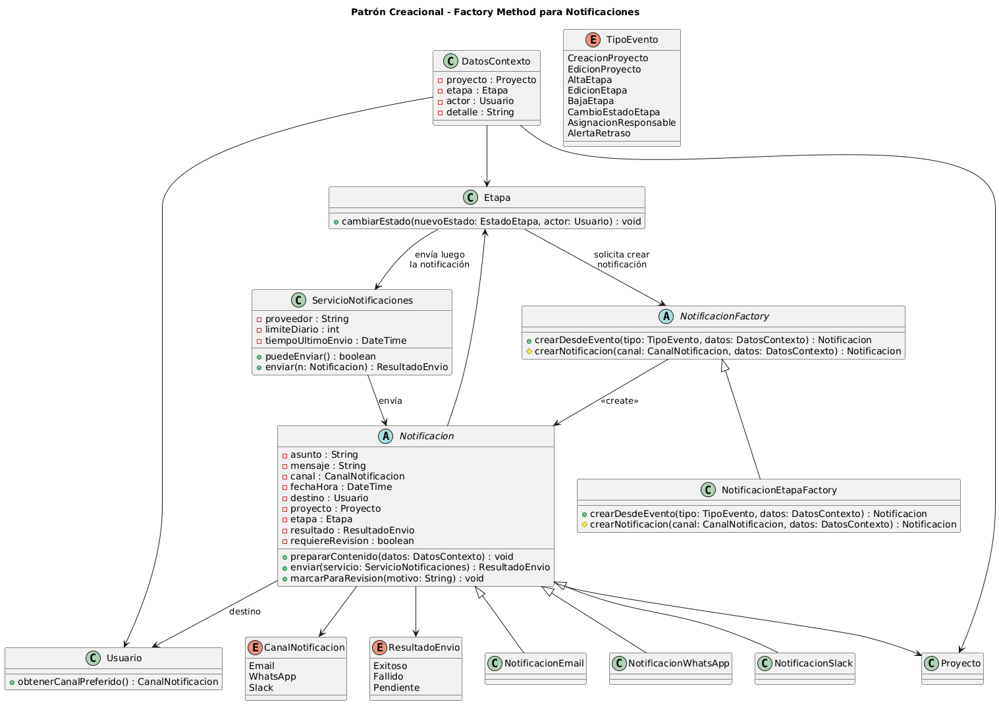

# Patrón de Diseño Creacional – Factory Method aplicado a Notificaciones

## 1. Introducción a los patrones creacionales y su relación con SOLID

Los patrones creacionales se enfocan en **cómo se crean los objetos** dentro de un sistema. Algunos ejemplos son: Singleton, Factory Method, Abstract Factory, Builder y Prototype.

La idea principal es **separar la creación** de objetos de su uso, para que el código quede más ordenado y fácil de extender. Esto se relaciona con SOLID:

- **SRP**: una clase no debería hacer “de todo”, por ejemplo usar una notificación y además crearla.
- **OCP**: debería ser posible agregar nuevas variantes sin tocar el código que ya funciona.
- **DIP**: las clases de alto nivel deberían depender de **interfaces/abstracciones**, no de clases concretas.

En nuestro sistema de gestión de proyectos audiovisuales, esto aparece claro en el módulo de **Notificaciones**, donde tenemos distintos eventos y canales.

---

## 2. Propósito y tipo del patrón seleccionado

El patrón usado es **Factory Method**, que es un patrón **creacional**.

Su propósito es:

> Definir una interfaz para crear objetos, pero dejar la decisión de qué clase 
> concreta instanciar en las subclases.

En nuestro caso:

- El **Product** es `Notificacion`.
- Los **Concrete Products** son:
  - `NotificacionEmail`
  - `NotificacionWhatsApp`
  - `NotificacionSlack`
- El **Creator** es `NotificacionFactory`, que ofrece el método `crearDesdeEvento(tipo: TipoEvento, datos: DatosContexto)`.
- El **Concrete Creator** es `NotificacionEtapaFactory`, que implementa la lógica concreta para decidir qué tipo de notificación crear.

Así, las clases que necesitan enviar notificaciones no se preocupan por el tipo concreto, solo piden una `Notificacion` a la factory.

---

## 3. Motivación detallada del problema y la solución

### Problema

En el sistema tenemos:

- la clase `Notificacion`, que se relaciona con `Proyecto`, `Etapa` y un `Usuario`,
- varios tipos de evento (`TipoEvento`: creación, edición, cambio de estado, etc.),
- varios canales (`CanalNotificacion`: Email, WhatsApp, Slack).

Sin un patrón, una clase como `Etapa` podría hacer algo así:

- ver el `TipoEvento`,
- ver el canal,
- según eso crear `new NotificacionEmail(...)` o `new NotificacionWhatsApp(...)`,
- armar el asunto y el mensaje.

Esto genera:

- mucho **if/switch** repartido por el código,
- **acoplamiento** a clases concretas,
- lógica repetida para armar mensajes,
- dificultad para agregar nuevos canales.

### Solución

Con Factory Method:

- Definimos una jerarquía de productos (`Notificacion` + subclases).
- Creamos la abstracción `NotificacionFactory`, con el método `crearDesdeEvento(...)` y el Factory Method protegido `crearNotificacion(...)`.
- Implementamos `NotificacionEtapaFactory`, que:
  - recibe el `TipoEvento` y el `DatosContexto`,
  - elige el `CanalNotificacion` adecuado,
  - crea la notificación concreta (`NotificacionEmail`, `NotificacionWhatsApp`, etc.),
  - completa asunto y mensaje.

La clase `Etapa` solo arma el contexto y llama a la factory. No necesita saber qué subclase concreta se instancia.

---

## 4. Estructura de clases con diagrama UML

La estructura del patrón en el sistema se ve en el siguiente diagrama UML:

En el diagrama se observa:

- `Notificacion` como clase abstracta con los datos comunes (asunto, mensaje, canal, destino, proyecto, etapa, resultado, etc.).
- `NotificacionEmail`, `NotificacionWhatsApp` y `NotificacionSlack` como subclases de `Notificacion`.
- `NotificacionFactory` como creator abstracto, con:
  - `crearDesdeEvento(tipo: TipoEvento, datos: DatosContexto)`
  - `crearNotificacion(canal: CanalNotificacion, datos: DatosContexto)`
- `NotificacionEtapaFactory` como implementación concreta de la factory.
- La relación con `Etapa` (que pide crear la notificación) y con
  `ServicioNotificaciones` (que la envía).

---

## 5. Justificación técnica de la solución propuesta

**Menor acoplamiento (DIP)**  
`Etapa` y los casos de uso no dependen de `NotificacionEmail` ni de `NotificacionWhatsApp`, sino de `Notificacion` y `NotificacionFactory`
(abstracciones). Esto aplica **DIP**.

**Extensibilidad (OCP)**  
Si mañana queremos agregar `NotificacionPush`:

- creamos una nueva subclase de `Notificacion`,
- ajustamos la factory.

El código cliente no cambia, así que cumplimos **OCP**.

**Responsabilidad única (SRP)**  
- `Etapa` se ocupa del ciclo de vida de las etapas.
- `Notificacion` y sus subclases se ocupan del contenido y comportamiento de las notificaciones.
- `ServicioNotificaciones` se encarga del envío.
- `NotificacionFactory` decide qué notificación concreta crear.

Cada clase tiene una responsabilidad clara.

**Consistencia y mantenimiento**  
Como toda la lógica de creación está en la factory:

- no repetimos código para armar mensajes, 
- las reglas de negocio de notificaciones están concentradas en un solo lugar, 
- es más fácil hacer cambios y encontrar errores.

En resumen, el uso de **Factory Method** para las notificaciones hace que el diseño sea más flexible, fácil de mantener y alineado con los principios SOLID.