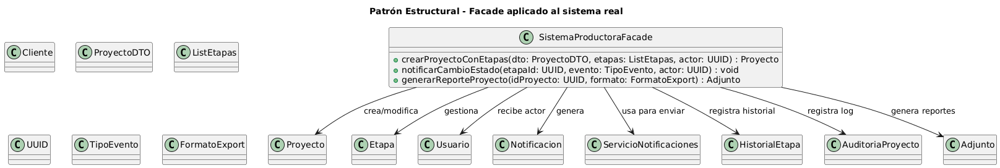

# Anexo - Aplicación de Patrón de Diseño Estructural - Nombrepatronelegido

## Patrones de Diseño Estructural y su relación con SOLID

Los patrones estructurales permiten organizar la arquitectura interna de un sistema, reduciendo el acoplamiento entre clases, promoviendo la composición por sobre la herencia y permitiendo extender funcionalidades sin modificar código existente, alineándose fuertemente con OCP y DIP.

El patrón Facade proporciona una interfaz simplificada para un conjunto de subsistemas complejos.
Permite ocultar la complejidad interna y exponer un único punto de acceso para las operaciones principales del sistema.

## Propósito y tipo del Patrón

### Propósito:

En el sistema de la Productora de Videos, la creación y gestión de un proyecto de video requiere interactuar con múltiples clases:

. GestorVideos

- GestorUsuarios

- GestorProyectos

- ServicioRender

- ServicioPublicacion

Esto generaba:

- Fuertes dependencias entre capas.

- Dificultad para mantener la UI y los casos de uso.

- Duplicación de llamadas a servicios.

El patrón Facade unifica estas operaciones en una única clase coordinadora:
SistemaProductoraFacade.

### Tipo:

Patrón estructural → Facade

✔ Reduce complejidad

✔ Desacopla subsistemas

✔ Simplifica la interacción del controlador con el modelo

---

## Motivación

Originalmente, los casos de uso requerían que un controlador (por ejemplo, "Crear Proyecto") invocara múltiples clases del dominio. Un controlador podía terminar ejecutando código como:

- Validar usuario → GestorUsuarios

- Crear proyecto → GestorProyectos

- Asociar videos → GestorVideos

- Procesar el render → ServicioRender

Esto generaba:

❌ Controladores gigantes

❌ Alto acoplamiento a varias clases concretas

❌ Dificultad para modificar el flujo sin romper todo

❌ Violación de DIP y SRP

# Nueva solución con Facade 

Se crea la clase:

✔ SistemaProductoraFacade

- Que ofrece métodos simples como:

- crearProyectoCompleto(usuarioId, datosProyecto, listaVideos)

- renderizarProyecto(proyectoId)

- publicarProyecto(proyectoId, plataforma)

La fachada coordina internamente todas las llamadas y simplifica la vida a los controladores.

## Estructura de Clases

## Justificación Técnica de la Estructura de Clases

✔ SistemaProductoraFacade

La fachada centraliza la funcionalidad del sistema.
Responsabilidad: proporcionar métodos simples que ejecutan flujos completos.
Beneficio: Desacoplamiento + SRP + DIP.

✔ GestorUsuarios / GestorProyectos / GestorVideos

Estas clases ya existían y mantienen su responsabilidad interna.
La fachada las coordina sin alterarlas → OCP.

✔ ServicioRender / ServicioPublicacion

Servicios complejos que la UI no debe conocer ni instanciar directamente.
La fachada los abstrae → DIP.